# babit

Proof of authority for autonomous agent actions.

babit records what an agent did, binds the action to the signed delegation that authorized it,
and produces a portable receipt that can be verified without the server.

## Flow

```mermaid
graph LR
    %% Flow definition
    You["[You]"]
    Dashboard["[Laptop Dashboard]"]
    Grant{{"Grant: browser.navigate, sandbox.run, desktop.exec"}}

    subgraph Agents ["Agent Surfaces"]
        direction TB
        Browser["[Browser agent (Solari)]\n(URL bar)"]
        Sandbox["[Sandbox agent]\n(Container)"]
        Desktop["[Desktop agent]\n(Monitor)"]
    end

    Replay["[rrweb replay]\n(Film strip)"]
    CaptureBucket[("(Capture bucket)\n[events]")]
    Notary["[Notary]\n(Signature)"]

    subgraph Ledger ["Ledger"]
        direction TB
        LedgerBlocks["[Block n]\n[Block n-1]\n[Block n-2]"]
    end

    Anchor["[External timestamp / anchor]\n(Cloud)"]
    Receipt["[Receipt]\n- content hash\n- signature\n- merkle path"]

    Verify["[Verify]\n(Check Mark)"]
    Anyone["[Anyone]"]

    BabitUI["[Babit Dashboard / API]\n(Monitor)"]

    %% Connections
    You --> Dashboard
    Dashboard --> Grant
    Grant --> Browser
    Grant --> Sandbox
    Grant --> Desktop

    Browser -.-> Replay
    Replay -.-> Browser

    Browser --> CaptureBucket
    Sandbox --> CaptureBucket
    Desktop --> CaptureBucket

    CaptureBucket --> Notary
    Notary --> LedgerBlocks

    LedgerBlocks --> Anchor
    LedgerBlocks --> Receipt

    Receipt --> Verify
    Anyone --> Verify

    BabitUI -.-> LedgerBlocks
    BabitUI -.-> Verify

    %% Styling
    style You fill:#e0f2f1,stroke:#008080,stroke-width:2px
    style Grant fill:#e0f2f1,stroke:#008080,stroke-width:2px
    style Notary fill:#e0f2f1,stroke:#008080,stroke-width:2px
    style Receipt fill:#e0f2f1,stroke:#008080,stroke-width:2px
    style Verify fill:#e0f2f1,stroke:#008080,stroke-width:2px
    style Anyone fill:#e0f2f1,stroke:#008080,stroke-width:2px

    style Browser fill:#f5f5f5,stroke:#9e9e9e,stroke-width:2px
    style Sandbox fill:#f5f5f5,stroke:#9e9e9e,stroke-width:2px
    style Desktop fill:#f5f5f5,stroke:#9e9e9e,stroke-width:2px
    style CaptureBucket fill:#f5f5f5,stroke:#9e9e9e,stroke-width:2px
    style LedgerBlocks fill:#f5f5f5,stroke:#9e9e9e,stroke-width:2px
    style Dashboard fill:#f5f5f5,stroke:#9e9e9e,stroke-width:2px
    style BabitUI fill:#f5f5f5,stroke:#9e9e9e,stroke-width:2px

    classDef default font-family:monospace,font-size:13px
```

## License

Proprietary and source-available; see `LICENSE`. No use, copy, or distribution without written
permission.
