# babit

Proof of authority for autonomous agent actions.

babit records what an agent did, binds the action to the signed delegation that authorized it,
and produces a portable receipt that can be verified without the server.

## What it does

- **Delegation:** a person issues a root grant; agents receive scoped, signed sub-grants.
- **Notarization:** each action is recorded against a grant, hash-chained, and signed with Ed25519.
- **Anchoring:** events are folded into a Merkle root and committed to an external anchor.
- **Verification:** a receipt contains the event, delegation chain, inclusion proof, anchor, and
  public key. It can be checked offline.

## Flow

```mermaid
graph LR
    %% Flow definition
    You["[You]"]
    Dashboard["[Laptop Dashboard]"]
    Grant{{"Grant: browser.navigate, sandbox.run, desktop.exec"}}

    subgraph Agents ["Agent Surfaces"]
        direction TB
        Browser["[Browser agent (Solari)]\n(URL bar)"]
        Sandbox["[Sandbox agent]\n(Container)"]
        Desktop["[Desktop agent]\n(Monitor)"]
    end

    Replay["[rrweb replay]\n(Film strip)"]
    CaptureBucket[("(Capture bucket)\n[events]")]
    Notary["[Notary]\n(Signature)"]

    subgraph Ledger ["Ledger"]
        direction TB
        LedgerBlocks["[Block n]\n[Block n-1]\n[Block n-2]"]
        Hashes["hash: 0x1a...\nhash: 0x4f...\nhash: 0x92..."]
    end

    Anchor["[External timestamp / anchor]\n(Cloud)"]
    Receipt["[Receipt]\n- content hash\n- signature\n- merkle path"]

    Verify["[Verify]\n(Check Mark)"]
    Anyone["[Anyone]"]

    BabitUI["[Babit Dashboard / API]\n(Monitor)"]
    Annotation["Human grants authority. Agents act on any URL or surface. Babit notarizes. Anyone verifies."]

    %% Connections
    You --> Dashboard
    Dashboard --> Grant
    Grant --> Browser
    Grant --> Sandbox
    Grant --> Desktop

    Browser -.-> Replay
    Replay -.-> Browser

    Browser --> CaptureBucket
    Sandbox --> CaptureBucket
    Desktop --> CaptureBucket

    CaptureBucket --> Notary
    Notary --> LedgerBlocks

    LedgerBlocks --> Anchor
    LedgerBlocks --> Receipt

    Receipt --> Verify
    Anyone --> Verify

    BabitUI -.-> LedgerBlocks
    BabitUI -.-> Verify

    %% Styling
    style You fill:#e0f2f1,stroke:#008080,stroke-width:2px
    style Grant fill:#e0f2f1,stroke:#008080,stroke-width:2px
    style Notary fill:#e0f2f1,stroke:#008080,stroke-width:2px
    style Receipt fill:#e0f2f1,stroke:#008080,stroke-width:2px
    style Verify fill:#e0f2f1,stroke:#008080,stroke-width:2px
    style Anyone fill:#e0f2f1,stroke:#008080,stroke-width:2px

    style Browser fill:#f5f5f5,stroke:#9e9e9e,stroke-width:2px
    style Sandbox fill:#f5f5f5,stroke:#9e9e9e,stroke-width:2px
    style Desktop fill:#f5f5f5,stroke:#9e9e9e,stroke-width:2px
    style CaptureBucket fill:#f5f5f5,stroke:#9e9e9e,stroke-width:2px
    style LedgerBlocks fill:#f5f5f5,stroke:#9e9e9e,stroke-width:2px
    style Dashboard fill:#f5f5f5,stroke:#9e9e9e,stroke-width:2px
    style BabitUI fill:#f5f5f5,stroke:#9e9e9e,stroke-width:2px

    style Annotation fill:none,stroke:none,font-size:16px

    classDef default font-family:monospace,font-size:13px
```



## Repository layout

```
proto/solari/ledger/v1/   API contract (generates Go, gRPC, REST gateway, OpenAPI)
gen/                      generated code (committed)
db/                       migrations, sqlc queries, event store
internal/core/            domain logic: signing, Merkle trees, canon, ids, clock
internal/ports/           shared interfaces
internal/service/         gRPC service implementations
internal/adapters/        Solari client, Postgres store, anchor clients
internal/interceptor/     browser/sandbox notarization of Solari actions
internal/receipt/         portable receipt and offline verification
internal/errs/            typed domain errors mapped to gRPC status
internal/app/             gRPC server and gateway assembly
cmd/                      nald, gateway, server, babit CLI
```

## Quick start

Requires Go 1.26 and Docker.

```sh
make db-up    # Postgres
make run      # nald on :9090 (migrations run on boot)
make gateway  # REST gateway on :8080, OpenAPI at /openapi.json
make test     # tests against Postgres
make generate # regenerate proto, sqlc, and mocks
```

## Configuration

Set via environment or a local `.env`:

| Variable | Purpose |
|---|---|
| `DATABASE_URL` | Postgres DSN. For Neon, include `?sslmode=require`. |
| `NAL_NOTARY_SEED` | 32-byte hex Ed25519 seed. Use the same value to keep receipts stable across restarts. |
| `NAL_JWT_SECRET` | Secret for signing session tokens. Generate with `openssl rand -base64 32` in production. |
| `SOLARI_API_KEY` | Optional; enables recordings and replay. |
| `NAL_API_KEY` | Optional gateway auth via `x-api-key`. |
| `CORS_ALLOWED_ORIGINS` | Optional comma-separated list of allowed frontend origins. Defaults to `https://babit-inky.vercel.app,http://localhost:5173,http://localhost:3000` when unset. |

## CLI

```sh
babit fetch --event <id> --grpc localhost:9090 --out receipt.json
babit verify receipt.json
```

`verify` runs offline (no server or database) and checks the signature, hash chain, Merkle proof,
anchor, and delegation authority.

## License

Proprietary and source-available; see `LICENSE`. No use, copy, or distribution without written
permission.
