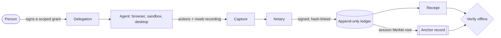

# babit

Proof of authority for autonomous agent actions.

When an AI agent drives a browser, runs code in a sandbox or acts on a desktop,
there is usually no way to prove afterwards what it did, or that anyone allowed it
to. babit records each action, binds it to the signed delegation that authorized
it, and issues a receipt that anyone can verify without trusting or contacting the
babit server.

**[Live demo](https://babit-inky.vercel.app)** · source-available, see `LICENSE` · [Architecture](docs/architecture.md)

## How it works

```mermaid
flowchart LR
    H([Person]) -->|signs a scoped grant| D[Delegation]
    D --> A[Agent: browser, sandbox, desktop]
    A -->|actions + rrweb recording| C[Capture]
    C --> N[Notary]
    N -->|signed, hash-linked| L[(Append-only ledger)]
    L -->|session Merkle root| X[[Anchor record]]
    L --> R[Receipt]
    R --> V{Verify offline}
    X --> V
```

- **Delegation.** Authority is explicit. A person grants an agent a named set of
  capabilities, such as `browser.navigate` or `sandbox.run`, as a signed grant.
- **Capture.** Agent surfaces send each action to the capture service. Browser
  actions keep a reference to the session's rrweb recording on Solari, so a run
  can be replayed, not just read as a log.
- **Notarization.** The notary signs each action into an append-only, hash-linked
  ledger, and records each session's Merkle root as an anchor.
- **Receipt.** A receipt carries the content hash, signature and Merkle path.
  Verifying it needs only the notary's public key and the session's Merkle root.

## Design decisions

- **Receipts verify without the server.** An audit log you have to request from
  the party being audited is not evidence, so verification runs offline with the
  `babit verify` command.
- **Ports and adapters.** The core and receipt logic sit behind interfaces in
  `internal/ports`, so the verifier and storage can be swapped and the core is
  tested without infrastructure.
- **Unguessable identifiers.** Receipts are meant to be shared as evidence, so
  guessable IDs would let anyone holding one probe for others.
- **Tenancy enforced in every service.** Project access is checked in capture,
  delegation and notary, and through the gRPC and replay interceptors, not only at
  the edge.

## Stack

Go (gRPC with a grpc-gateway REST edge), PostgreSQL with sqlc, Protobuf via buf,
React and TypeScript for the console. Build, test and run targets are in the
`Makefile`; [`examples/`](examples/) has notarized browser and sandbox clients.

## License

Proprietary and source-available; see `LICENSE`. No use, copy, or distribution
without written permission.
