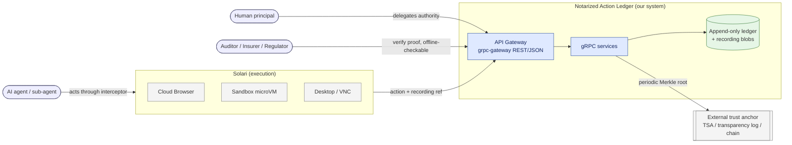
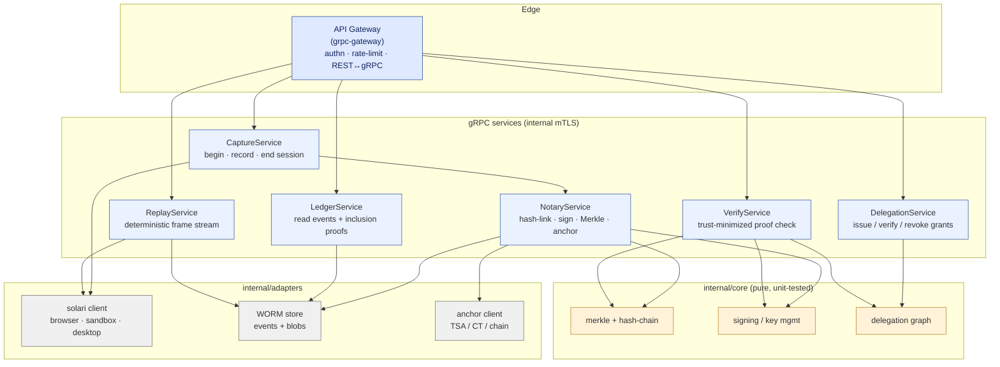
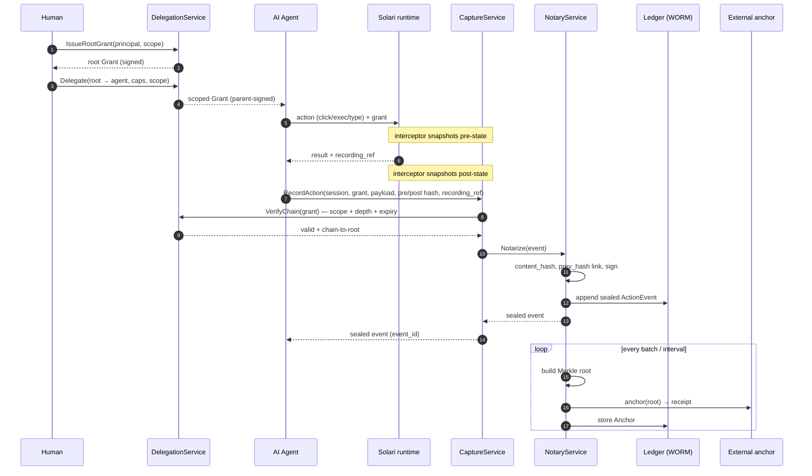
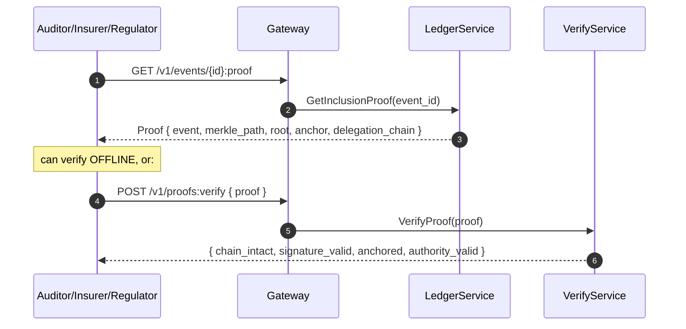

# Notarized Action Ledger — Architecture & System Flow

> **Product:** a cryptographic chain-of-custody for AI-agent actions. Every action an
> agent takes on Solari (browser, sandbox, desktop) is captured, tied to a signed
> human-to-agent-to-sub-agent delegation chain, hash-linked into an append-only log,
> committed to a Merkle root and external anchor, and independently verifiable offline —
> designed to produce court-ready, machine-verifiable evidence for regulated environments.

## How to get these into Excalidraw

Every diagram below is Mermaid. In Excalidraw: **top-left menu → "Open" is not needed** —
use the command palette (`Ctrl/Cmd+P`) → **"Mermaid to Excalidraw"**, or the
[mermaid-to-excalidraw playground](https://mermaid-to-excalidraw.vercel.app/), paste a
block, and it drops editable shapes onto the canvas. Do the four blocks on four frames.

---

## 1. System context (C4 level 1)



---

## 2. Container / service architecture



**Layering (proto-first, contract-down).** See [code-layer-design.md](./code-layer-design.md).

```
proto/ (contract)  →  cmd/gateway (grpc-gateway)  →  internal/<service> (gRPC)
                                                   →  internal/core (domain, pure)
                                                   →  internal/adapters (solari, store, anchor)
```

---

## 3. Runtime flow — capture → notarize → anchor



---

## 4. Verification flow — trust-minimized



**What each check proves**

| Check | Question it answers |
|---|---|
| `chain_intact` | Was the log tampered with? (prev_hash links unbroken) |
| `signature_valid` | Did our notary actually seal this event? |
| `anchored` | Was the Merkle root committed externally, so we can't backdate? |
| `authority_valid` | Did a real human authorize this exact agent for this exact action? |

---

## 5. Excalidraw layout hints (if you place boxes by hand)

Four frames, left→right: **Context → Containers → Capture flow → Verify flow.**

| Frame | Key shapes | Emphasis |
|---|---|---|
| Context | 3 actors (left), NAL box (center), Solari + Anchor (right) | one arrow loop: delegate → act → record → verify |
| Containers | Gateway on top, 6 service pills, core (yellow) + adapters (grey) rows | color = layer; arrows only downward |
| Capture flow | vertical swimlanes per participant | highlight the `Notarize` → `append` → `anchor` band |
| Verify flow | 2 lanes (verifier, us) | callout: "verifiable offline" on the Proof arrow |

Palette: core `#dfe9ff`, services `#eaf1ff`, domain `#fff2d8`, adapters `#f0f0f0`,
stores `#e6f6e6`, external `#f4f4f4`.

## Repository layout

```
proto/solari/ledger/v1/   API contract (generates Go, gRPC, REST gateway, OpenAPI)
gen/                      generated code (committed)
db/                       migrations, sqlc queries, event store
internal/core/            domain logic: signing, Merkle trees, canon, ids, clock
internal/ports/           shared interfaces
internal/service/         gRPC service implementations
internal/adapters/        Solari client, Postgres store, anchor clients
internal/interceptor/     browser/sandbox notarization of Solari actions
internal/receipt/         portable receipt and offline verification
internal/errs/            typed domain errors mapped to gRPC status
internal/app/             gRPC server and gateway assembly
cmd/                      nald, gateway, server, babit CLI
```
